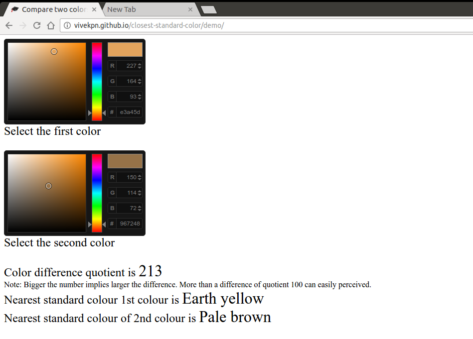

# Closest Standard Color
Using the color difference quotient, find out the difference between color and use if for different purpose such as blacklisting, avoid showing similar colours adjacent to each other and many other.

## Demo

